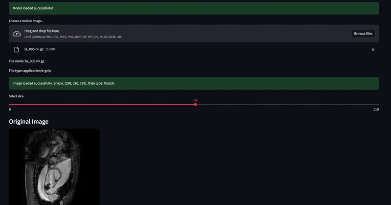

# Medical Image Tumor Segmentation

A deep learning-based application for tumor segmentation in medical images using U-Net architecture.

## Video example : 




## Features

- Interactive web interface using Streamlit
- Support for multiple medical image formats (NIfTI, DICOM, standard image formats)
- Example images for demonstration
- Real-time segmentation visualization
- Slider controls for threshold adjustment
- Support for 3D and 4D medical image data

## Installation

1. Clone the repository:
```bash
git clone https://github.com/Psantaniello24/MEDICAL-IMAGE-SEGMENTATION.git
```

2. Create a virtual environment and activate it:
```bash
python -m venv venv
source venv/bin/activate  # On Windows: venv\Scripts\activate
```

3. Install the required packages:
```bash
pip install -r requirements.txt
```

## Usage

1. Start the Streamlit application:
```bash
python -m streamlit run app.py
```

2. Open your web browser and navigate to the URL shown in the terminal (usually http://localhost:8501)

3. Use the application:
   - Upload a medical image or use the provided examples
   - Adjust the segmentation threshold using the slider
   - View the segmentation results and analysis

## Project Structure

```
medical-image-segmentation/
├── app.py                 # Main Streamlit application
├── requirements.txt       # Python dependencies
├── README.md             # Project documentation
├── src/                  # Source code directory
│   ├── __init__.py
│   ├── utils.py          # Utility functions
│   └── model.py          # Model architecture
├── data/                 # Data directory
│   ├── raw/             # Raw data (not included in repo)
│   └── processed/       # Processed data (not included in repo)
├── models/              # Trained models (not included in repo)
└── static/              # Static files
    └── examples/        # Example images
```

## Supported File Formats

- Standard image formats: JPG, PNG, BMP, TIFF
- Medical imaging formats: NIfTI (.nii, .nii.gz)
- DICOM formats: .dcm, .ima (requires SimpleITK)

## Requirements

- Python 3.8+
- TensorFlow 2.x
- Streamlit
- OpenCV
- NumPy
- Matplotlib
- Pillow
- Nibabel
- SimpleITK (optional, for better DICOM support)

## Troubleshooting

If you encounter issues with NIFTI files:
1. Install SimpleITK: `pip install SimpleITK`
2. Try converting your files to a different format
3. Make sure your NIFTI files are properly formatted
4. For DICOM series, try converting to NIFTI first

## Disclaimer

⚠️ This application is for demonstration purposes only and should not be used for actual medical diagnosis. The predictions are not clinically validated.

## License

This project is licensed under the MIT License - see the LICENSE file for details.

## Acknowledgments

- U-Net architecture by Olaf Ronneberger et al.
- TensorFlow and Keras for deep learning framework
- Streamlit for web interface
- Nibabel and SimpleITK for medical image processing 